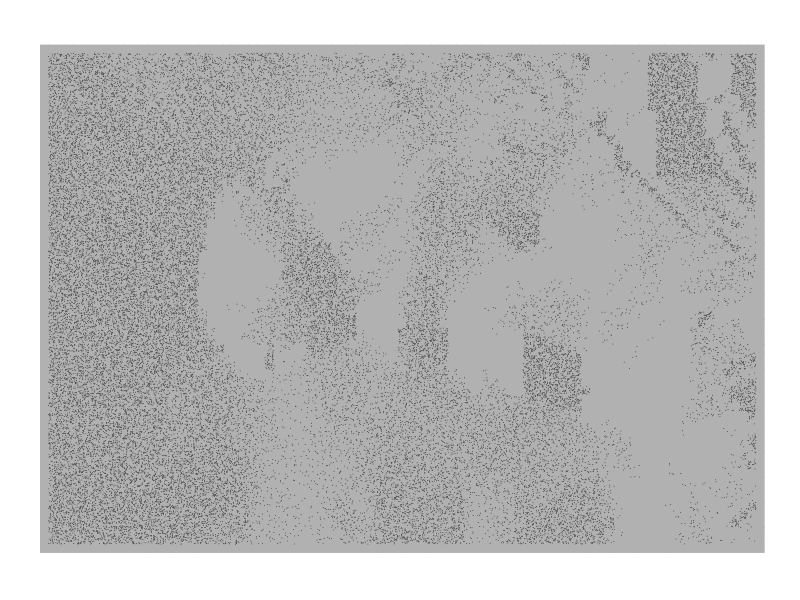

ShadeR
======

*ShadeR* provide a new geom for ggplot2, *geom\_fleck*, to make dot
density plots and an associated stat, *aspect\_shading*, to generate
shadding effect.

Installation
------------

*ShadeR* is inspired by this
[post](https://eliocamp.github.io/codigo-r/2018/02/how-to-make-shaded-relief-in-r/?utm_content=buffer628d9&utm_medium=social&utm_source=twitter.com&utm_campaign=buffer)
of **Elio Campitelli** and relies on his package
[metR](https://github.com/eliocamp/metR) for the computation of
derivatives.

These two packages can be installed with the following comamands:

    # install.packages("devtools")
    devtools::install_github("eliocamp/metR")

    # And intsallation of ShadeR:
    devtools::install_github("Clement-Viguier/ShadeR")

Examples
--------

An example of The Andes relief and Pacific Ocean ploted with
*geom\_fleck* and *stat\_aspect\_shading*:  Like any geom\_similar to point,
*geom\_fleck* accepts changes of aes like colour, used here to
distinguish the ocean from the land.

THe resolution can be given as an aesthetic or is computed if
`res = NULL` in the geom\_fleck call.

Another aesthetic is \* sun.angle \* that modify the position of the sun
for the shading computation by stat functions (only
stat\_aspect\_shading for now). Below it is used with image\_animate:

Three one-line examples you can try once ShadeR is installed:

Author
------

-   **Clement Viguier**

Acknowledgments
---------------

-   **Elio Campitelli** for the [shading
    code](https://eliocamp.github.io/codigo-r/2018/02/how-to-make-shaded-relief-in-r/?utm_content=buffer628d9&utm_medium=social&utm_source=twitter.com&utm_campaign=buffer).
-   **James Cheshire** and **Oliver Uberti** for the inspiration.
-   \*\* Tyler Morgan-Wall \*\* for the shading computation from his
    [rayshader package](https://github.com/tylermorganwall/rayshader)
-   **Hadley Whickham** for ggplot2.
