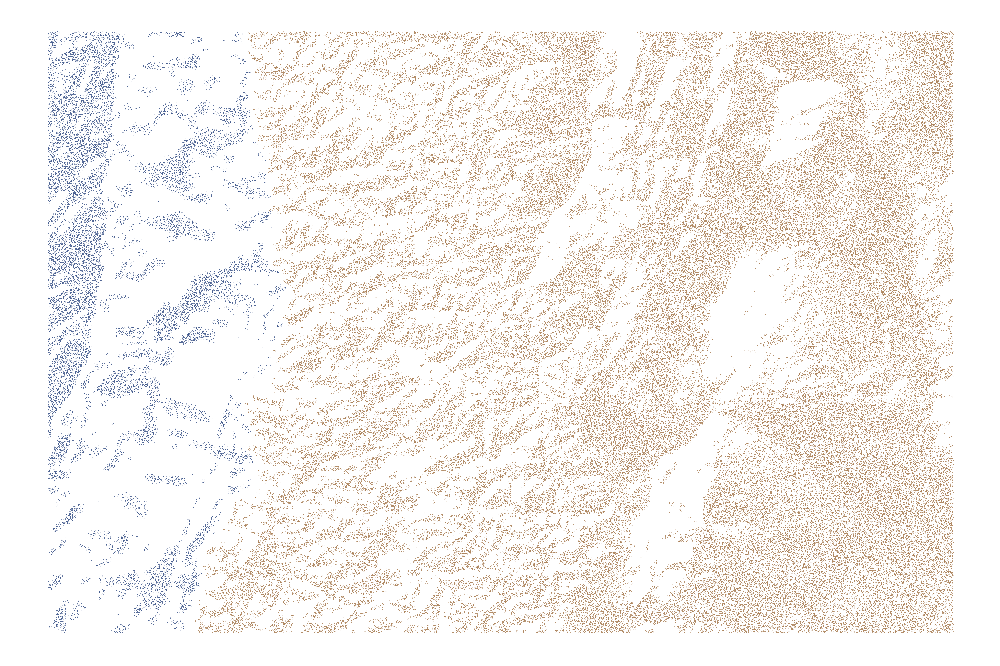
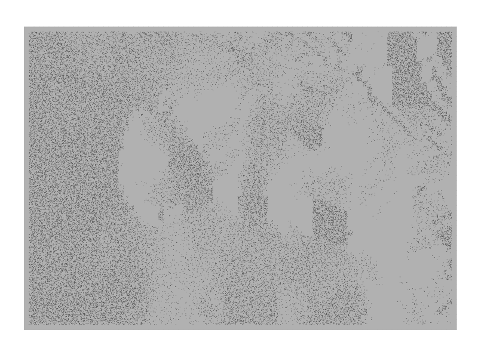

# ShadeR

*ShadeR* provide a new geom for ggplot2, *geom_fleck*, and an associated stat, *aspect_shading*, to make dot density plots.


## Installation

*ShadeR* is inspired by this [post](https://eliocamp.github.io/codigo-r/2018/02/how-to-make-shaded-relief-in-r/?utm_content=buffer628d9&utm_medium=social&utm_source=twitter.com&utm_campaign=buffer) of **Elio Campitelli** and relies on his package [metR](https://github.com/eliocamp/metR) for the computation of derivatives.

These two packages can be installed with the following comamands:

```
# install.packages("devtools")
devtools::install_github("eliocamp/metR")

# And intsallation of ShadeR:
devtools::install_github("Clement-Viguier/ShadeR")

```

## Examples

An example of The Andes relief and Pacific Ocean ploted with *geom_fleck* and *stat_aspect_shading*:


Like any geom_similar to point, *geom_fleck* accepts changes of aes like colour, used here to identify the ocean from the land.

Another aesthetic is * sun.angle * that modify the position of the sun for the shading computation by stat functions (only stat_aspect_shading for now). Here it is used with image_animate:



```{r  echo = F}
library(ggplot2)
library(ShadeR)
```

Three one-line examples you can try once ShadeR is installed:

```{r geom_fleck, echo = T, warning= FALSE, message=FALSE}
ggplot(volcano2, aes(x, y, z = z)) + geom_fleck()+ coord_fixed() + theme_void() + ggtitle("Volcano shaded with geom_fleck")

ggplot(volcano2, aes(x, y, z = z)) + geom_fleck(stat = "identity", density = 10)+ coord_fixed() + theme_void() + ggtitle("Volcano altitude visualised with geom_fleck and stat = \"identity\"." )

ggplot(volcano2, aes(x, y, z = z)) + geom_fleck(aes(colour = (x+y)^2))+ coord_fixed() + theme_void() + ggtitle("Color and density are also controlled with aes()." )

```
## Author

* **Clement Viguier** 

## Acknowledgments

* **Elio Campitelli** for the [shading code](https://eliocamp.github.io/codigo-r/2018/02/how-to-make-shaded-relief-in-r/?utm_content=buffer628d9&utm_medium=social&utm_source=twitter.com&utm_campaign=buffer).
* **James Cheshire** and **Oliver Uberti** for the inspiration.
* **Hadley Whickham** for ggplot2.
